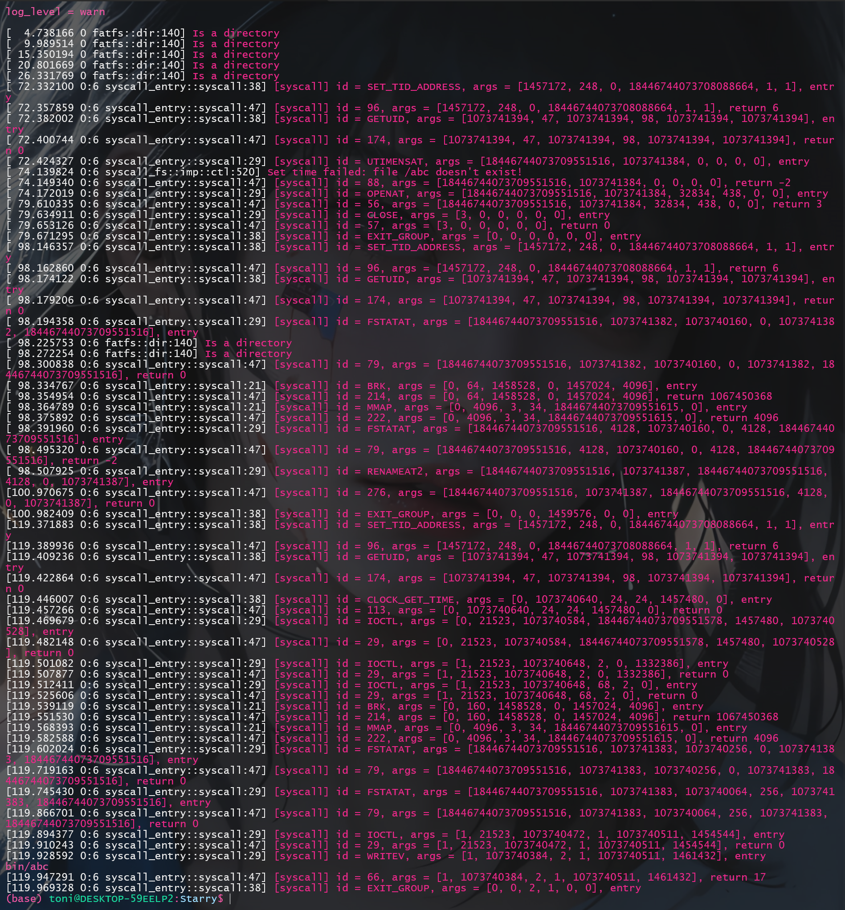
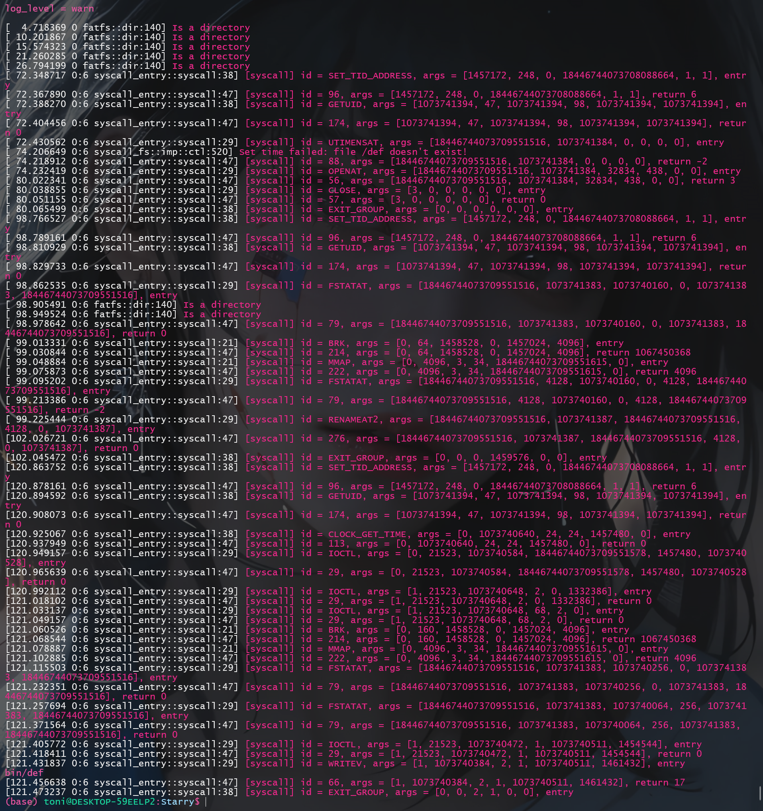

# 1 编程作业
## 1.1 实验3.1
> 修改代码，使得 busybox ls bin/abc 正常输出 bin/abc。

### 1.1.1 对拍结果
- 在`syscall`中使用`error!`输出日志后运行结果如下:
    ```bash
    ==================================================== busybox touch abc ====================================================

    [ 60.140455 0:6 syscall_entry::syscall:38] [syscall] id = SET_TID_ADDRESS, args = [1457172, 248, 0, 18446744073708088664, 1, 1], entry
    [ 60.172291 0:6 syscall_entry::syscall:47] [syscall] id = 96, args = [1457172, 248, 0, 18446744073708088664, 1, 1], return 6
    [ 60.195900 0:6 syscall_entry::syscall:38] [syscall] id = GETUID, args = [1073741394, 47, 1073741394, 98, 1073741394, 1073741394], entry
    [ 60.221776 0:6 syscall_entry::syscall:47] [syscall] id = 174, args = [1073741394, 47, 1073741394, 98, 1073741394, 1073741394], return 0
    [ 60.239349 0:6 syscall_entry::syscall:29] [syscall] id = UTIMENSAT, args = [18446744073709551516, 1073741384, 0, 0, 0, 0], entry
    [ 62.010726 0:6 syscall_entry::syscall:47] [syscall] id = 88, args = [18446744073709551516, 1073741384, 0, 0, 0, 0], return 0
    [ 62.028929 0:6 syscall_entry::syscall:38] [syscall] id = EXIT_GROUP, args = [0, 0, 0, 0, 0, 0], entry

    ==================================================== busybox mv abc bin/ ====================================================

    [ 80.708070 0:6 syscall_entry::syscall:38] [syscall] id = SET_TID_ADDRESS, args = [1457172, 248, 0, 18446744073708088664, 1, 1], entry
    [ 80.723000 0:6 syscall_entry::syscall:47] [syscall] id = 96, args = [1457172, 248, 0, 18446744073708088664, 1, 1], return 6
    [ 80.743645 0:6 syscall_entry::syscall:38] [syscall] id = GETUID, args = [1073741394, 47, 1073741394, 98, 1073741394, 1073741394], entry
    [ 80.754384 0:6 syscall_entry::syscall:47] [syscall] id = 174, args = [1073741394, 47, 1073741394, 98, 1073741394, 1073741394], return 0
    [ 80.775450 0:6 syscall_entry::syscall:29] [syscall] id = FSTATAT, args = [18446744073709551516, 1073741382, 1073740160, 0, 1073741382, 18446744073709551516], entry
    [ 80.806092 0:6 fatfs::dir:140] Is a directory
    [ 80.834425 0:6 syscall_entry::syscall:47] [syscall] id = 79, args = [18446744073709551516, 1073741382, 1073740160, 0, 1073741382, 18446744073709551516], return 0
    [ 80.856809 0:6 syscall_entry::syscall:21] [syscall] id = BRK, args = [0, 64, 1458528, 0, 1457024, 4096], entry
    [ 80.865595 0:6 syscall_entry::syscall:47] [syscall] id = 214, args = [0, 64, 1458528, 0, 1457024, 4096], return 1067450368
    [ 80.876861 0:6 syscall_entry::syscall:21] [syscall] id = MMAP, args = [0, 4096, 3, 34, 18446744073709551615, 0], entry
    [ 80.893941 0:6 syscall_entry::syscall:47] [syscall] id = 222, args = [0, 4096, 3, 34, 18446744073709551615, 0], return 4096
    [ 80.917225 0:6 syscall_entry::syscall:29] [syscall] id = FSTATAT, args = [18446744073709551516, 4128, 1073740160, 0, 4128, 18446744073709551516], entry
    [ 81.021491 0:6 syscall_entry::syscall:47] [syscall] id = 79, args = [18446744073709551516, 4128, 1073740160, 0, 4128, 18446744073709551516], return -64
    [ 81.042344 0:6 syscall_entry::syscall:29] [syscall] id = WRITE, args = [2, 1073740112, 47, 0, 0, 0], entry
    mv: can't stat 'bin/abc': No error information
    [ 81.059920 0:6 syscall_entry::syscall:47] [syscall] id = 64, args = [2, 1073740112, 47, 0, 0, 0], return 47
    [ 81.072551 0:6 syscall_entry::syscall:38] [syscall] id = EXIT_GROUP, args = [1, 0, 0, 1459576, 0, 1], entry

    ==================================================== busybox ls bin/abc ====================================================

    [ 99.668975 0:6 syscall_entry::syscall:38] [syscall] id = SET_TID_ADDRESS, args = [1457172, 248, 0, 18446744073708088664, 1, 1], entry
    [ 99.684396 0:6 syscall_entry::syscall:47] [syscall] id = 96, args = [1457172, 248, 0, 18446744073708088664, 1, 1], return 6
    [ 99.703854 0:6 syscall_entry::syscall:38] [syscall] id = GETUID, args = [1073741394, 47, 1073741394, 98, 1073741394, 1073741394], entry
    [ 99.720334 0:6 syscall_entry::syscall:47] [syscall] id = 174, args = [1073741394, 47, 1073741394, 98, 1073741394, 1073741394], return 0
    [ 99.743118 0:6 syscall_entry::syscall:38] [syscall] id = CLOCK_GET_TIME, args = [0, 1073740640, 24, 24, 1457480, 0], entry
    [ 99.756191 0:6 syscall_entry::syscall:47] [syscall] id = 113, args = [0, 1073740640, 24, 24, 1457480, 0], return 0
    [ 99.773509 0:6 syscall_entry::syscall:29] [syscall] id = IOCTL, args = [0, 21523, 1073740584, 18446744073709551578, 1457480, 1073740528], entry
    [ 99.792659 0:6 syscall_entry::syscall:47] [syscall] id = 29, args = [0, 21523, 1073740584, 18446744073709551578, 1457480, 1073740528], return 0
    [ 99.815217 0:6 syscall_entry::syscall:29] [syscall] id = IOCTL, args = [1, 21523, 1073740648, 2, 0, 1332386], entry
    [ 99.824071 0:6 syscall_entry::syscall:47] [syscall] id = 29, args = [1, 21523, 1073740648, 2, 0, 1332386], return 0
    [ 99.836051 0:6 syscall_entry::syscall:29] [syscall] id = IOCTL, args = [1, 21523, 1073740648, 68, 2, 0], entry
    [ 99.849454 0:6 syscall_entry::syscall:47] [syscall] id = 29, args = [1, 21523, 1073740648, 68, 2, 0], return 0
    [ 99.863974 0:6 syscall_entry::syscall:21] [syscall] id = BRK, args = [0, 160, 1458528, 0, 1457024, 4096], entry
    [ 99.879705 0:6 syscall_entry::syscall:47] [syscall] id = 214, args = [0, 160, 1458528, 0, 1457024, 4096], return 1067450368
    [ 99.895548 0:6 syscall_entry::syscall:21] [syscall] id = MMAP, args = [0, 4096, 3, 34, 18446744073709551615, 0], entry
    [ 99.903246 0:6 syscall_entry::syscall:47] [syscall] id = 222, args = [0, 4096, 3, 34, 18446744073709551615, 0], return 4096
    [ 99.919318 0:6 syscall_entry::syscall:29] [syscall] id = FSTATAT, args = [18446744073709551516, 1073741383, 1073740256, 0, 1073741383, 18446744073709551516], entry
    [100.011304 0:6 syscall_entry::syscall:47] [syscall] id = 79, args = [18446744073709551516, 1073741383, 1073740256, 0, 1073741383, 18446744073709551516], return -64
    [100.042643 0:6 syscall_entry::syscall:29] [syscall] id = WRITE, args = [2, 1073740208, 34, 0, 0, 0], entry
    ls: bin/abc: No error information
    [100.070083 0:6 syscall_entry::syscall:47] [syscall] id = 64, args = [2, 1073740208, 34, 0, 0, 0], return 34
    [100.090969 0:6 syscall_entry::syscall:38] [syscall] id = EXIT_GROUP, args = [1, 0, 0, 1459576, 0, 1], entry
    ```
- 在`Linux`系统中在相同的位置执行相同的命令, `strace`输出如下(这里只给出`mv abc bin/`的结果):
    ```bash
    ...
    ioctl(0, TCGETS, {B38400 opost isig icanon echo ...}) = 0
    stat("bin/", {st_mode=S_IFDIR|0755, st_size=4096, ...}) = 0
    lstat("abc", {st_mode=S_IFREG|0644, st_size=0, ...}) = 0
    lstat("bin/abc", 0x7fffbdb041a0)        = -1 ENOENT (No such file or directory)
    rename("abc", "bin/abc")                = 0
    lseek(0, 0, SEEK_CUR)                   = -1 ESPIPE (Illegal seek)
    close(0)                                = 0
    close(1)                                = 0
    close(2)                                = 0
    exit_group(0)                           = ?
    +++ exited with 0 +++
    ```
### 1.1.2 定位并修改错误---未完成`rename`系统调用
`strace`输出的内容很多, 这里我们只需要关注`rename`系统调用前后的内容即可, 其区别总结如下:

1. `strace`输出内容包括`rename`系统调用, 而我们的`Starry`没有输出响应的系统调用
    这意味着执行`rename`系统调用前发生了错误, 因此关注前一个系统调用`lstat`
2. `FSTATAT`返回类型不匹配
   分析可知, `lstat`和`FSTATAT`应该是`rename`系统调用的前置, `strace`中其返回值为`-1 ENOENT`, 而在`Starry`中返回值为`-64`
   查阅`ulib/axstarry/syscall_utils/src/lib.rs`和`target/debug/build/axerrno-011bdf3cce8cadef/out/linux_errno.rs`可知, `-64`返回的是:
    ```rust
    // target/debug/build/axerrno-011bdf3cce8cadef/out/linux_errno.rs

    /// Machine is not on the network
    ENONET = 64,
    ```
   `ENOENT`在同目录下, 同样存在:
    ```rust
        // target/debug/build/axerrno-011bdf3cce8cadef/out/linux_errno.rs

    /// No such file or directory
    ENOENT = 2,
    ```
   分析我们执行的指令可知, `FSTATAT`对应的系统调用`syscall_fstatat`作用是查看目标路径下的文件信息, 在执行该命令前, 其应当是不存在的, 故其应返回`ENOENT`而不是`ENONET`
3. 观察`syscall_fstatat`
   查看`syscall_fstatat`代码可知, 其对解析出的路径调用`get_stat_in_fs`完成信息获取
4. 修改`get_stat_in_fs`
   由于我们知道其错误返回了`ENONET`, 故搜索该字段即可迅速定位并完成修改
    ```rust
        // 是文件
        return if let Ok(file) = new_fd(real_path.to_string(), 0.into()) {
            match file.get_stat() {
                Ok(stat) => Ok(stat),
                Err(e) => {
                    debug!("get stat error: {:?}", e);
                    Err(SyscallError::EINVAL)
                }
            }
        } else {
            Err(SyscallError::ENOENT) // 修改为ENOENT
        };
    ```
### 1.1.3 定位并修改错误---完成缺失的`rename`系统调用
根据提示完成`syscall_renameat2`系统调用:
- 实现`flags`结构体
  在[此处](https://man7.org/linux/man-pages/man2/renameat2.2.html)找到对应的276号系统调用说明
  可知, `flags`包含了:`RENAME_EXCHANGE`, `RENAME_NOREPLACE`和`RENAME_WHITEOUT`, 故实现如下:
    ```rust
    use bitflags::bitflags;
    bitflags! {
    /// sys_renameat2 用到的标志位
    pub struct RenameFlags: u32 {
    const NONE = 0;
    // LAB3 其他可能的选项都有什么？
    // 参考: https://man7.org/linux/man-pages/man2/renameat2.2.html
    const RENAME_EXCHANGE = 1; // 原子交换旧路径和新路径。两个路径名必须存在
    const RENAME_NOREPLACE = 2; // 如果newpath已经存在, 不要覆盖重命名的新路径。
    const RENAME_WHITEOUT  = 4; // 仅适用于覆盖/并集文件系统实现
    }
    }
    ```
- 实现`syscall_renameat2`
  此处我没有实现`RENAME_EXCHANGE`和`RENAME_WHITEOUT`, 只对`RENAME_NOREPLACE`进行了实现, 其核心就是调用底层的`axfs::api::rename`
    ```rust
    /// 276
    /// 重命名文件或目录
    // LAB3 你需要完成这个 syscall
    pub fn syscall_renameat2(
    old_dirfd: usize,
    old_path: *const u8,
    new_dirfd: usize,
    new_path: *const u8,
    flags: usize,
    ) -> SyscallResult {
    let old_path = deal_with_path(old_dirfd, Some(old_path), false).unwrap();
    let new_path = deal_with_path(new_dirfd, Some(new_path), false).unwrap();
    let proc_path = FilePath::new("/proc").unwrap();
    if old_path.start_with(&proc_path) || new_path.start_with(&proc_path) {
        return Err(SyscallError::EPERM);
    }

    let new_path_str = new_path.path();

    let mut replace = true;

    if let Some(flag) = RenameFlags::from_bits(flags.try_into().unwrap()) {
        if flag.contains(RenameFlags::RENAME_EXCHANGE) {
            panic!("not supported!");
        }
        if flag.contains(RenameFlags::RENAME_NOREPLACE) {
            replace = false;
        }
        if flag.contains(RenameFlags::RENAME_WHITEOUT) {
            panic!("not supported!");
        }
    }
    if !path_exists(old_path_str) {
        error!("old path not exists:{}", old_path_str);
        return Err(SyscallError::ENOENT);
    }

    if !replace && path_exists(new_path_str) {
        error!("new path exists:{}", new_path_str);
        return Err(SyscallError::EEXIST);
    }

    // error!("old path = {}", old_path_str);
    // error!("new path = {}", new_path_str);

    let res = axfs::api::rename(old_path_str, new_path_str);

    match res {
        Ok(()) => Ok(0),
        Err(e) => Err(e.into()),
    }

    // return Err(SyscallError::EPERM);
    }
    ```

### 1.1.4 输出结果
输出结果如下:
    


## 1.2 实验3.2
> 修改代码，使得 busybox mv def bin 正常输出 bin/def。

### 1.2.1 对拍结果
根据题目分析可知, 此处的错误原因在于内核将`bin`看成了一个文件, 而不是一个目录
因此, 此处对拍可以不用跟`strace`对比, 其实际输出太过复杂, 可以和我们之前的`实验3.1`进行对拍
> PS:此处借助VScode的比较工具对2次的输出进行比对


通过`VSCode`的对比我们可以更快地定位对拍的不同:
- 在调用`syscall_renameat2`之前, 左侧的`实验3.1`不存在系统调用`FACCESSAT`, 而右侧的`实验3.2`则存在
- 在调用`syscall_renameat2`之前的系统调用`FSTATAT`返回值不同:左侧的`实验3.1`返回值为`-2`, 而右侧的`实验3.2`返回`0`

### 1.2.2 对拍分析
1. 对拍分析--`FACCESSAT`
查阅`syscall_faccessat`的注释可知, 该函数用于`获取文件权限`与判别目录还是文件无关, 可暂时跳过

2. 对拍分析--`FSTATAT`
    再次回到熟悉的函数`syscall_fstatat`, 发现其对路径字符串的解析在`get_stat_in_fs`中
    分析`get_stat_in_fs`, 发现其判断路径为文件夹或文件的依据是:

    ```rust
    if !real_path.ends_with("/") && !real_path.ends_with("include")
    ```

    大致可以判断出错误原因了, 因为其判断路径是文件夹或者文件的依据是其是否以`/`结尾, 参考`syscall_renameat2`中的提示, 使用`metadata`来判断其是否为文件:
    
    ```rust
    let mut is_file = false;

    let meta_data = metadata(real_path);
    if meta_data.is_ok() {
        is_file = meta_data.unwrap().is_file();
    } else {
        return Err(SyscallError::ENOENT);
    }

    if is_file {
        // 是文件
        ...
    } else {
        // 是目录
        ...
    }
    ```
### 1.2.3 输出结果
输出结果如下:
    

# 2 问答作业
## 2.1 思考题1
- 思考题1.1
> 思考题1.1：这些代码具体在 ~/.cargo 下的哪个文件夹？

我的`log`库的路径为:
```bash
~/.cargo/registry/src/mirrors.tuna.tsinghua.edu.cn-df7c3c540f42cdbd/log-0.4.19/src/lib.rs
```
其中`src`的下一级目录为设置的镜像代理

- 思考题1.2
> 思考题1.2：如果忘记 make clean 会发生什么？

阅读Makefile:
```Makefile
clean: clean_c
	rm -rf $(APP)/*.bin $(APP)/*.elf
	cargo clean
```
可知, `make clean`进行了`cargo clean`, 如果直接`make run`会导致依赖库不会重新下载

## 2.3 思考题2
> 思考题2：在部分往届内核及运行指引 一节提到的内核中挑选一个，描述它在默认情况下启动后会执行哪些测例（抑或是直接启动终端）。你不一定要真的运行那个内核，读文档或搜索即可。

选择内核为[xv6](https://github.com/oscomp/2021oscomp-best-kernel-design-impl/tree/2021-xv6)(~~嘿嘿, 其实是对xv6比较熟悉, 偷个懒~~)
`xv6`运行测例位于`xv6-user`文件夹下, 并需要再在`Makefile`中尽显指定:
```Makefile
UPROGS=\
	$U/_init\
	$U/_sh\
	$U/_cat\
	$U/_echo\
	$U/_grep\
	$U/_ls\
	$U/_kill\
	$U/_mkdir\
	$U/_xargs\
	$U/_sleep\
	$U/_find\
	$U/_rm\
	$U/_rmdir\
	$U/_wc\
	$U/_info\
	$U/_usertests\
	$U/_strace\
	$U/_mv\
	$U/_test\
	$U/_grind\
	$U/_forktest\
	$U/_stressfs\
	$U/_cowtest\
	$U/_lazytests\
	$U/_mount\
	$U/_umount\
	$U/_dup3\
	$U/_mmaptests\
	$U/_sync\
	$U/_signal_test
```
`Makefile`以上文件对应于`xv6-user`文件夹下去掉下划线并以`.c`结尾的源文件, 如`init.c`, `test.c`等

## 2.3 思考题3
- 思考题3.1
> 思考题3.1：为什么要在开头结尾各输出一句，会不会太过重复？（提示：考虑执行出错的情况，或者 sys_exit ）

一方面, `sys_exit`输出一次后就终止了, 另一方面, 收尾各自输出依据可以判断是否出现了`panic`(~~不确定是不是这个意思~~)


- 思考题3.2
> 思考题3.2：为什么要结尾还要输出一遍 syscall 的完整参数，只输出返回值行不行？（提示：考虑像 sys_yield 这样的 syscall）

`sys_yield`这类系统调用让出了CPU, 因此通过打印参数, 可以观测让出CPU期间, 其寄存器有没有被修改, 或是将系统让出CPU的时间进行记录(~~不确定是不是这个意思~~)